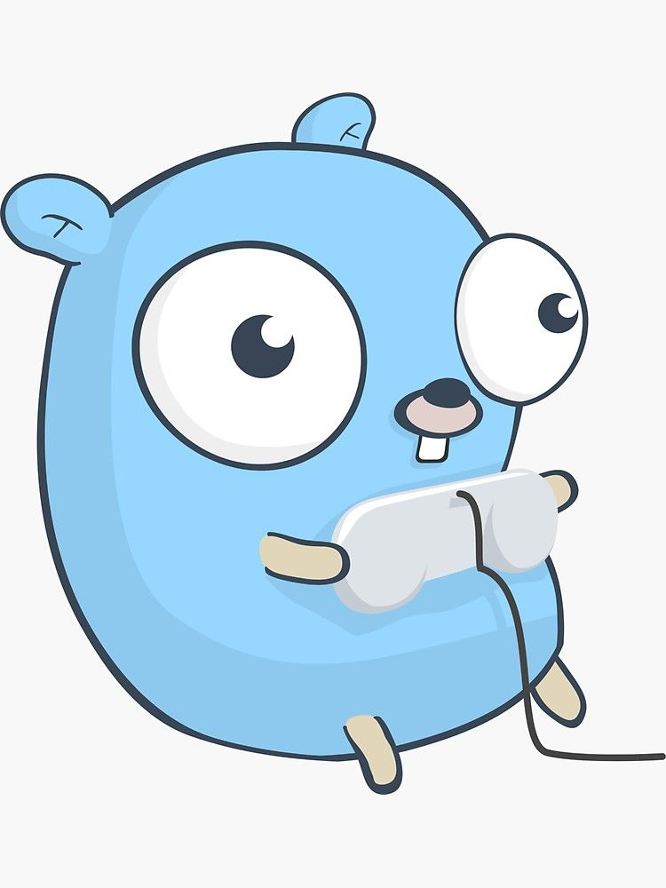
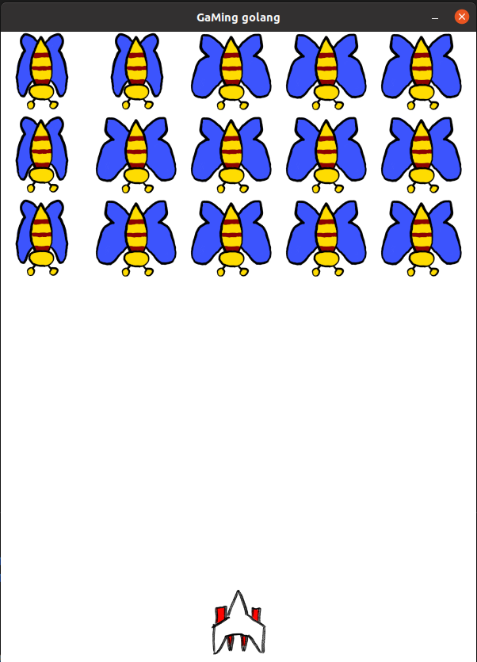

# My go game

a mini game made with golang with:

- Component-based Architecture
- Hardware-independent physics
- Sprites animations
- Keyboard event detection

## How to run

- go build (to compile)
- ./go-game (to execute)
